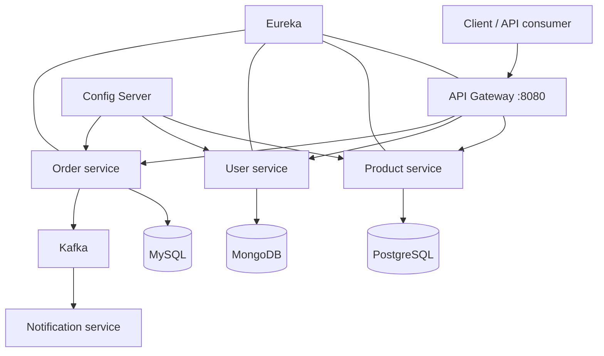

# eCommerce Microservices Platform

> A backend-focused e-commerce system built to practise the design and operation of a production-style Java microservices architecture: independently deployable services, API gateway, centralized configuration, service discovery, identity management, asynchronous events, observability, and container orchestration.

## Highlights

- **Seven Spring Boot services** built as a single Maven multi-module repository.
- **Database per service**: PostgreSQL for products, MongoDB for users, and MySQL for carts and orders.
- **Spring Cloud Gateway** provides routing, JWT validation, Redis-backed rate limiting, a Resilience4j circuit breaker, and aggregated Swagger UI.
- **Keycloak integration** for OAuth2/OIDC authentication and programmatic user provisioning.
- **Event-driven order flow**: the order service publishes an `OrderCreatedEvent` to Kafka through Spring Cloud Stream; the notification service consumes it.
- **Operational tooling**: Actuator, Prometheus metrics endpoints, Micrometer tracing to Zipkin, Docker Compose, Kubernetes manifests, and a GitHub Actions verification workflow.

## Architecture



### Services

| Service | Port | Responsibility | Main integrations |
| --- | ---: | --- | --- |
| `configserver` | 8888 | Serves centralized, profile-specific configuration from the native config repository | Spring Cloud Config, Spring Cloud Bus / RabbitMQ |
| `eureka` | 8761 | Service registry and discovery | Netflix Eureka |
| `gateway` | 8080 | Public API entry point, route aggregation and cross-cutting concerns | Spring Cloud Gateway, OAuth2 Resource Server, Redis, Resilience4j, OpenAPI |
| `product` | 8081 | Product catalog and search API | Spring Data JPA, PostgreSQL |
| `user` | 8082 | User profile API and identity provisioning | Spring Data MongoDB, Keycloak Admin REST API |
| `order` | 8083 | Shopping cart and order creation workflow | Spring Data JPA, MySQL, load-balanced `RestClient`, Spring Cloud Stream / Kafka |
| `notification` | 8084 | Consumes order-created events | Spring Cloud Stream / Kafka |

## Order flow

1. A client creates a cart item through the gateway and passes `X-User-ID`.
2. `order-service` resolves the requested product and user through service discovery and a load-balanced Spring `RestClient`.
3. The cart is persisted in MySQL.
4. On checkout, the service validates the cart and user, persists an order with its order items, clears the cart, and publishes `OrderCreatedEvent` through `StreamBridge`.
5. `notification-service` consumes the Kafka event and logs the notification action.

## Tech stack

| Area | Technologies |
| --- | --- |
| Language & build | Java 21, Maven multi-module build |
| Framework | Spring Boot 3.5.7, Spring Cloud 2025.0.0 |
| Cloud patterns | Config Server, Netflix Eureka, Gateway, Spring Cloud Stream, Spring Cloud Bus |
| Security | Spring Security OAuth2 Resource Server, Keycloak (OIDC/JWT) |
| Data | Spring Data JPA, Spring Data MongoDB, PostgreSQL 16, MySQL 8 |
| Messaging & cache | Kafka, RabbitMQ, Redis |
| Resilience | Resilience4j circuit breaker and retry |
| Observability | Actuator, Micrometer, Prometheus, Zipkin, Grafana/Loki experiment configs |
| Documentation | Springdoc OpenAPI / Swagger UI |
| Deployment | Docker Compose, Kubernetes YAML (Minikube/Kind-ready) |
| Quality | JUnit 5, Mockito, AssertJ, GitHub Actions CI |

## API overview

All application endpoints are exposed through the gateway at `http://localhost:8080` once the environment is configured. The gateway protects application routes with a JWT; Swagger-related endpoints are public.

| Area | Gateway route | Operations |
| --- | --- | --- |
| Products | `/api/products` | Create, list, fetch by ID, update, soft-delete, and keyword search |
| Users | `/api/users` | Create, list, fetch by ID, and update user profiles; creation provisions the identity in Keycloak |
| Cart | `/api/cart` | Add, list, and remove cart items |
| Orders | `/api/orders` | Create an order from the current cart and publish an event |

Cart and order requests require an `X-User-ID` request header. For example:

```bash
curl --request POST http://localhost:8080/api/cart \
  --header "Authorization: Bearer <access-token>" \
  --header "X-User-ID: <mongo-user-id>" \
  --header "Content-Type: application/json" \
  --data '{"productId":"1","quantity":2}'
```

## OpenAPI

The gateway aggregates the REST services' OpenAPI specifications.

- Gateway Swagger UI: `http://localhost:8080/swagger-ui/index.html`
- Product docs: `http://localhost:8081/v3/api-docs`
- User docs: `http://localhost:8082/v3/api-docs`
- Order docs: `http://localhost:8083/v3/api-docs`

## Run locally

### Prerequisites

- JDK 21
- Maven 3.9+
- Docker Engine with Docker Compose v2
- At least 6 GB of available Docker memory is recommended because Kafka, Keycloak, databases, and the Spring services run together.

> **Important:** the checked-in Maven wrapper scripts do not include the `.mvn/wrapper` files, so use a locally installed Maven command (`mvn`) at the moment.

### 1. Prepare environment variables

Copy the committed template, then replace every `change_me_*` value before using the environment anywhere outside local development:

```bash
cp deploy/docker/.env.example deploy/docker/.env
```

`KEYCLOAK_CLIENT_UID` is the ID of the `oauth2-pkce` client in the included realm export. If you create the client yourself instead of importing the export, replace it with the UUID shown in Keycloak.

### 2. Build application JARs

Run from the repository root:

```bash
mvn -B clean verify
```

The Dockerfiles expect the resulting JAR in each service's `target/` directory.

### 3. Start the stack

```bash
cd deploy/docker
docker compose up -d --build
docker compose ps
```

Useful local endpoints:

| Component | URL |
| --- | --- |
| API Gateway | `http://localhost:8080` |
| Swagger UI | `http://localhost:8080/swagger-ui/index.html` |
| Eureka dashboard | `http://localhost:8761` |
| Keycloak | `http://localhost:8181` |
| RabbitMQ Management | `http://localhost:15672` |
| pgAdmin | `http://localhost:5050` |
| Zipkin | `http://localhost:9411` |

Follow startup logs when diagnosing a dependency issue:

```bash
docker compose logs -f config-server eureka product user order gateway notification
```

### 4. Import the Keycloak realm

After Keycloak becomes available:

1. Sign in to `http://localhost:8181` with `KEYCLOAK_ADMIN_USERNAME` and `KEYCLOAK_ADMIN_PASSWORD`.
2. Import `additional/keycloak/keycloak-backups/realm-export-ecom-app.json`.
3. Verify that the `ecom-app` realm and the `oauth2-pkce` client exist.
4. Use an access token issued by that realm when calling gateway application routes.

### Stop and reset

```bash
docker compose down
```

To also remove the local database and broker volumes (destructive):

```bash
docker compose down -v
```

## Kubernetes

Local deployment manifests are in [`deploy/k8s`](deploy/k8s). They cover a namespace, demo secrets and ConfigMap, infrastructure services, application deployments, services, and health probes.

```bash
mvn -B clean package
kubectl apply -f deploy/k8s/namespace.yaml
kubectl apply -f deploy/k8s/secrets.yaml
kubectl apply -f deploy/k8s/configmap.yaml
kubectl apply -f deploy/k8s/infra.yaml
kubectl apply -f deploy/k8s/apps.yaml
kubectl get pods -n ecommerce
```

For Minikube/Kind image-build and port-forwarding details, see [`deploy/k8s/README.md`](deploy/k8s/README.md).

> The Kubernetes files are designed for local learning and demonstration. Before a real deployment, replace demo secrets, provide persistent storage, configure an ingress/TLS, use managed backing services where appropriate, and configure the Config Server endpoint for in-cluster DNS.

## Testing and CI

```bash
mvn test
```

The repository contains focused unit tests for product, user, cart, and order business logic. They use JUnit 5, Mockito, and AssertJ to verify such cases as soft deletion, cart validation, order-event publication, and user provisioning orchestration.

GitHub Actions runs `mvn -B clean verify` on pushes to `main`/`master` and on pull requests.

## Repository layout

```text
.
├── configserver/       # Centralized configuration service and service configs
├── eureka/             # Service registry
├── gateway/            # Reactive API gateway and security
├── product/            # Product catalog service
├── user/               # User profiles and Keycloak administration
├── order/              # Cart, checkout, inter-service clients, Kafka publisher
├── notification/       # Kafka order-event consumer
├── deploy/
│   ├── docker/         # Docker Compose runtime stack
│   └── k8s/            # Local Kubernetes manifests
└── additional/         # Keycloak export and Prometheus/Loki exploration configs
```

## Current scope and next steps

This is an educational, backend-only portfolio project rather than a production e-commerce product. The next changes that would most improve production readiness are:

- Add Flyway or Liquibase migrations and remove Hibernate schema creation from runtime setup.
- Automate the Keycloak realm import for a fully reproducible local setup.
- Add integration tests with Testcontainers for PostgreSQL, MySQL, MongoDB, Kafka, and Keycloak.
- Derive `X-User-ID` from the authenticated JWT instead of accepting it as a client-supplied header.
- Add stock reservation, idempotency, and transactional/outbox handling around checkout.
- Publish versioned Docker images in CI and deploy with Helm/Kustomize plus external secrets.

## What this project demonstrates

This repository demonstrates hands-on work with Java 21, Spring Boot, Spring Cloud architecture patterns, REST API design and validation, relational and document databases, service-to-service communication, event-driven messaging, OAuth2/OIDC security, resilience patterns, observability, Docker, Kubernetes, automated testing, and CI.
